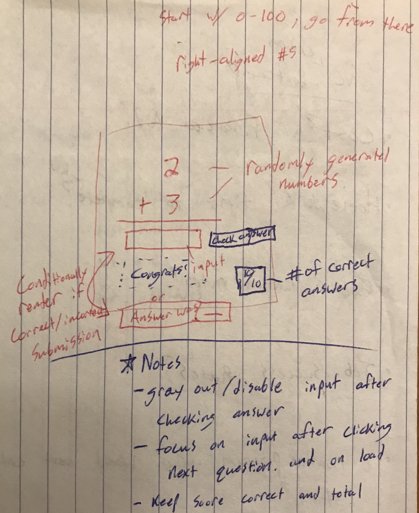

## Planning

Provide a `planning.md` file that gives insight into how you planned to build this application, including brief details on how the user interacts with the interface and how the services communicate. This does not need to be polished; a photo of a whiteboard sketch or two with an accompanying story is sufficient.

Discuss how you would add (or actually add) one or two of the following enhancements to your application as you see fit:

- Add unit testing
- Generating more complex mathematical expressions
- Maintain a history of questions
- Keep a running total score
- Give multiple questions at once
- Utilize a timer
- Limit the number of incorrect answers
- Brand the application
- _Anything_ else

# Planning Addition Rules!

